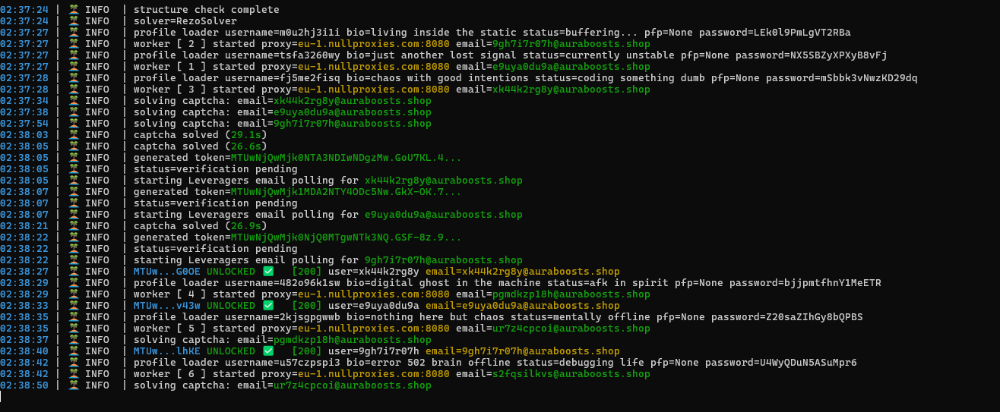
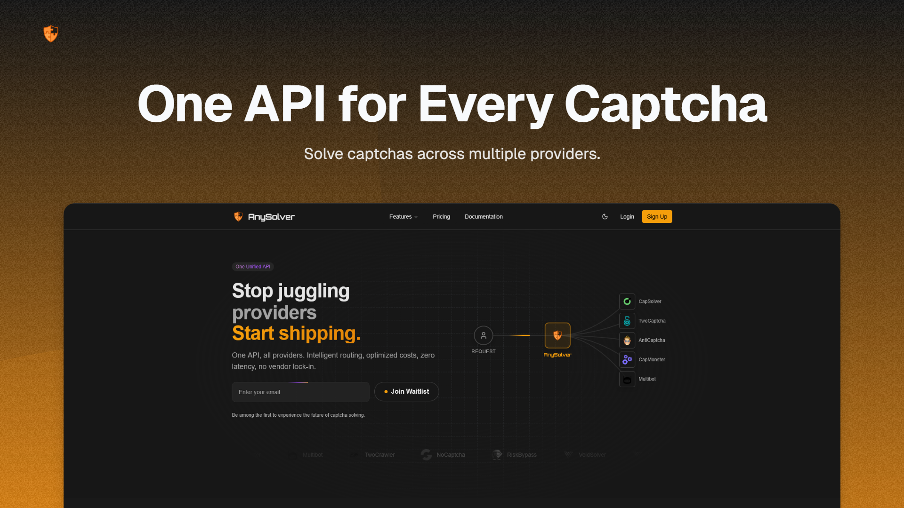

# Cyberbeach Discord Account Creator


 
Need a custom tool built? Reach out and get a fair quote, no bs.

- [](https://cyberbeach.cc)
- [](https://discord.gg/cyberbeach)



---

## features

- Async architecture for better performance
- Multi-threaded execution
- Support for 10+ captcha solvers
- Dynamic header generation
- Live console title updates
- Optional account customization
- Optional email verification support
- Optional phone verification support

---

# setup

## 1. configure anysolver (required)

 
AnySolver is the CAPTCHA-solving backend used by this tool.
When Cyberbeach returns anti-bot challenges, this project sends solving tasks to AnySolver and uses the returned tokens/cookies to continue its tasks.



- Create an account at [anysolver.com](https://anysolver.com)
- Add balance
- Create API key
- Configure providers in priority mode

(Recommended Since Update)

| Rank | Provider | Status |
|---|---|---|
| 1 | CapLess | Recommended |
| 2 | RezoSolver | Stable |
| 3 | BruxSolver | Budget Option |

---

## 2. install dependencies

Open a terminal inside the project folder and run:

```bash
pip install -r requirements.txt
```

---


## 3. configure `input/config.json`

Edit `config.json` and fill in your API keys + settings.

Example:

```json
{
  "solver": {
    "anysolver_api_key": "your_anysolver_api_key"
  },

  "mail": {
    "provider": "cybertemp",

    "cybertemp": {
      "api_key": "your_cybertemp_api_key"
    }

  },

  "phone": {
    "enabled": false,
    "provider": "herosms_or_vaksms",

    "vaksms": {
      "api_key": "",
      "service": "ds",
      "country": "uk",
      "operator": null,
      "sms_timeout": 180,
      "poll_interval": 3
    },

    "herosms": {
      "api_key": "",
      "service": "ds",
      "country": 16,
      "operator": null,
      "sms_timeout": 180,
      "poll_interval": 3
    }
  }, 

  "verification": {
    "enabled": true
  },

  "customise": {
    "hypesquad": true,
    "pfp": true,
    "bio": true,
    "status": true
  },

  "threads": 1,
  "debug": true
}
```

Below is a quick explanation of the most important settings inside `input/config.json`.

| Section | Description |
|---|---|
| `data.anysolver_api_key` | Your AnySolver API key used for CAPTCHA solving |
| `mail.provider` | Mail system to use (`cybertemp`) |
| `mail.cybertemp.api_key` | API key for [cybertemp.xyz](https://cybertemp.xyz/pricing) (domains auto-fetched via `type=discord`) |
| `phone.enabled` | Enable phone verification |
| `phone.provider` | SMS provider to use |
| `verification.enabled` | Enables email verification |
| `customise.*` | Enables account customisation features |
| `threads` | Number of worker threads |
| `debug` | Enables hidden console logging |

---

## 4. configure proxies

Add proxies to:

```txt
input/proxies.txt
```

Format:

```txt
user:pass@ip:port
```

Example:

```txt
john123:password123@127.0.0.1:8000
proxyuser:mypass@192.168.1.10:9000
```

PS: Make sure they are **Sticky** proxies & **Residential** for the best results.

(Recommended Since Update)

| Rank | Provider | Status |
|---|---|---|
| 1 | DataImpulse.com | Recommended |
| 2 | SeamlessProxies.com | Stable |
| 3 | NullProxies.com | Budget Option |

---

## 5. optional user customization

Inside `input/user/` you can add:

```txt
username.txt
bio.txt
status.txt
```

You can also place profile pictures inside:

```txt
input/user/pfp/
```

---

## 6. start the program

Run:

```bash
python main.py
```

Or use:

```bash
start.bat
```

---

# disclaimer

This project is provided for educational and research purposes only.

Users are responsible for how they use this software.